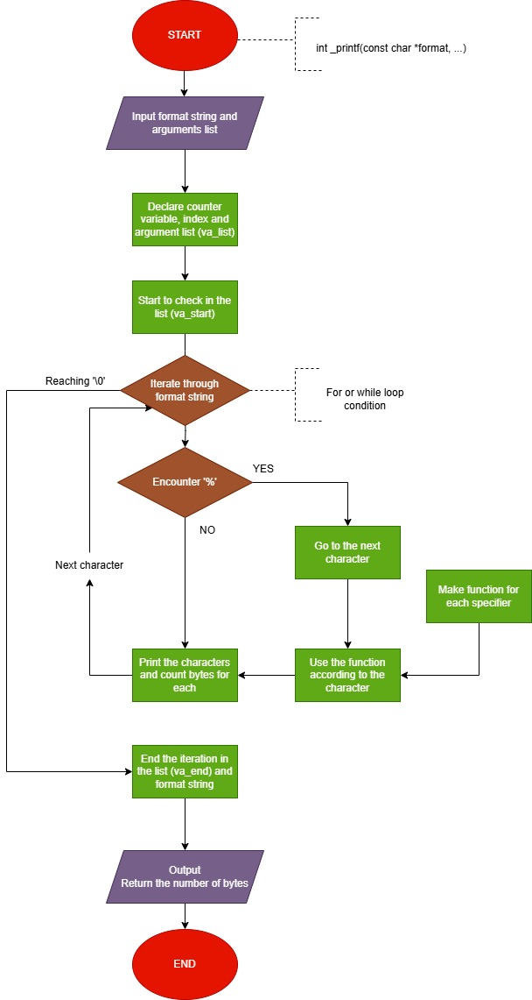

# C - printf

## Description
A pedagogical exercise in recreating printf's essential mechanisms, following Holberton's project-based learning approach.

## Compilation Command
```gcc -Wall -Werror -Wextra -pedantic -std=gnu89 -Wno-format *.c```

## Requirements
- Editors: ```vi```, ```vim```, ```emacs```
- Ubuntu 20.04 LTS 
- To compile we will use ```gcc``` using the options ```-Wall -Werror -Wextra -pedantic -std=gnu89 -Wno-format```
- Our code should use the Betty style. It will be checked using betty-style.pl and betty-doc.pl
- No global variables, except :
    ```write```, ```malloc```, ```free```, ```va_start```, ```va_end```, ```va_copy```, ```va_arg```.
- No more than 5 functions per file
- All our header files should be include guarded
- All our prototypes of all our functions will be on the ```main.h``` header file.

## Exemples
Here are some exemples for the use of _printf function :

```c
_printf("Number: %d, Char: %c, String: %s\n", num, ch, str);

int byte_count = _printf("%s %d%% complete\n", "Progress:", 100);
_printf("Number of characters printed : %d\n", byte_count);
```

The output for this will be :
```
Number: 42, Char: A, String: Hello, World!

Progress: 100% complete
Number of characters printed : 24
```

## Man page
The man page provides a detailed explanation of the function. To see the full documentation, run our man page like this: ```man 3 _printf```

## Testing
We have made a testing file with many basic cases and edge cases to be sure our function works correctly.
Here are some exemples:

```c
_printf("%d %i %c %s %%\n", 100, 200, 'X', "Test");
_printf("Large numbers: %d %i %d\n", 1234567, 9876543, 5555555);
_printf("String with escapes: %s\n", "Hello\nWorld\t!");
```

We also used valgrind to be sure there is no memory leaks or issues :
```valgrind ./a.out```

## Flowchart


## Authors
* Anaïs Choisy https://github.com/o0anais0o
* Valentin Dumont https://github.com/proser-v